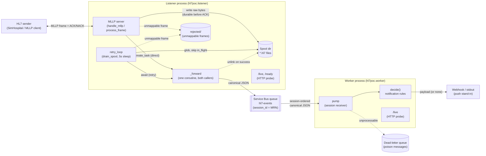
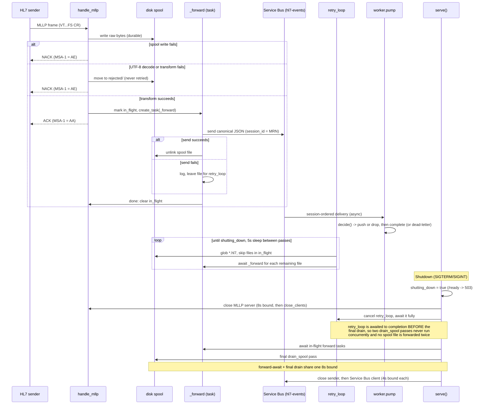

# Containers

## Component view



The direct forward and `retry_loop` are two callers of the same `_forward` coroutine, not two
channels. The `in_flight` set keeps a `retry_loop` pass from re-sending a spool file a direct
forward still owns; it does not cover two concurrent `drain_spool` passes, which is why shutdown
stops `retry_loop` before the final drain (below).

## Message lifecycle (including shutdown drain)



Two images, one per service, each built from the repo root so the build context
includes the root `pyproject.toml`, `uv.lock`, and the shared `packages/core`
member.

```bash
docker build -f packages/listener/Dockerfile -t hl7poc-listener .
docker build -f packages/worker/Dockerfile -t hl7poc-worker .
```

Both follow the same two-stage shape: a `ghcr.io/astral-sh/uv:python3.14-bookworm-slim`
builder stage runs `uv sync --frozen --no-dev --no-editable --package hl7poc-<svc>`
(deps cached as their own layer before source is copied in), then a
`python:3.14-slim-bookworm` runtime stage copies only `/app/.venv`, runs as a
non-root user, and `ENTRYPOINT`s straight on the console script with no `CMD` —
the bare command runs the service. There is no `HEALTHCHECK`: k8s probes
`/live` and `/ready` directly instead.

## Env-var contract

Both images are configured entirely through environment variables — nothing
is baked in at build time. Defaults and CLI-flag equivalents live in
[`docs/configuration.md`](configuration.md), the single source for them; this
section only says which variables each image reads.

**Listener** (`hl7poc-listener`, `EXPOSE 2575 8080`):

- `SERVICEBUS_CONNECTION`, `SERVICEBUS_QUEUE` — where canonical messages are forwarded
- `HTTP_PORT` — the `/live` and `/ready` probe port
- `MLLP_PORT` — the MLLP listen port
- `SPOOL_DIR` — durable spool directory; set to `/spool` in the image, owned by
  the non-root user and declared as a `VOLUME`, so a k8s volume mount survives a
  container restart

**Worker** (`hl7poc-worker`, `EXPOSE 8081`):

- `SERVICEBUS_CONNECTION`, `SERVICEBUS_QUEUE` — the canonical-message queue to consume
- `HTTP_PORT` — the `/live` probe port
- `WEBHOOK_URL` — where qualifying notifications are pushed

## Local test infrastructure vs. shipping code

`docker-compose.yml` and `servicebus-config.json` are **local test
infrastructure**: SimHospital stands in for an HL7 source and the Service Bus
emulator stands in for the broker, so a developer can run the listener and
worker from the checkout (`uv run hl7listener` / `uv run hl7worker`) against
something that looks like production. These Dockerfiles are **shipping
production code** destined for a k8s cluster. Compose never builds or runs
either service image, and it never will — that boundary is deliberate, not an
oversight to "complete" later.

Out of scope here: k8s manifests, Helm charts, an image registry, and CI image
publishing are separate tickets when wanted. Image scanning and SBOM
generation are likewise out of scope.

## Service Bus emulator's SQL dependency

The `servicebus` service in `docker-compose.yml` needs a SQL Server-compatible
backing store; its `mssql` neighbor is `mcr.microsoft.com/mssql/server:2022-latest`,
matching Microsoft's current emulator setup docs. It used to be
`mcr.microsoft.com/azure-sql-edge:latest`, but Azure SQL Edge was retired on
2025-09-30, so that image is no longer maintained.
